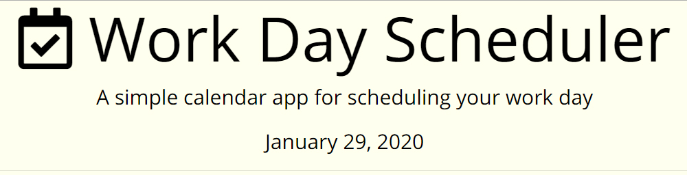
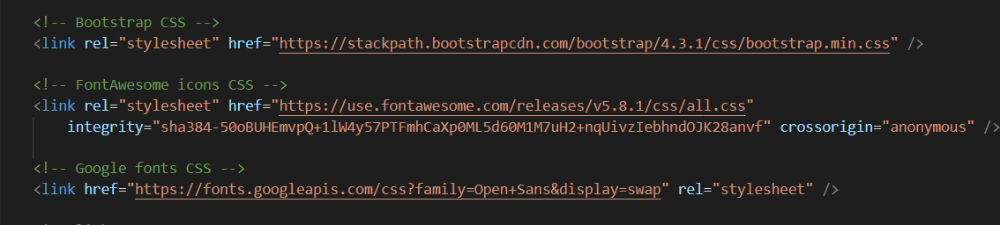
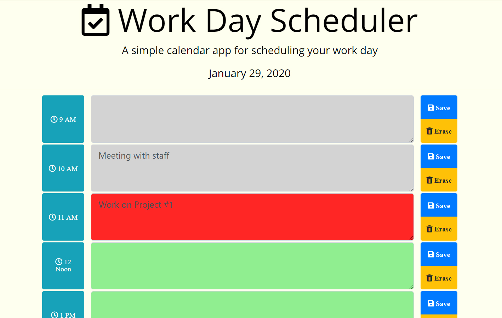
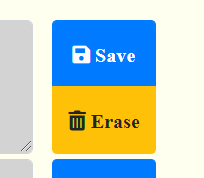

# Work Day Planner

A simple template for a day planner, with the ability to save inputs to local storage. 

## Premise

The need to stay organized as a coder is very important, and a well-designed planner makes all the difference. This template demonstrates organized appointment blocks easily filled by the user, with buttons to stare and erase then from local storage.

### Site repository (public)

* [Github Repository]( https://github.com/whoerman/Work-Day-Planner) -  https://github.com/whoerman/Work-Day-Planner
* [Github Page]( https://whoerman.github.io/Work-Day-Planner/) -  https://whoerman.github.io/Work-Day-Planner/

This program runs the html/css/js right on github, and all css and js references are dynamic to websites.

### Prerequisites

This program runs the html/css/js right on github, and all css and js references are dynamic to websites.

## Built With

* [VSCode](https://code.visualstudio.com/) - Editor

## Reference Libraries

* [Bootstrap](https://getbootstrap.com/) - Dynamic Front-end Framework library with cross-browser capabilities
* [Font Awesome](https://fontawesome.com/) - vector icons

* [Google Fonts](https://fonts.google.com/) - font library

* [Moment JS](https://momentjs.com/) - dynamic timing



### Use Explanation



When opened, the schedule blocks will be empty, unless previous has been stored in local storage.

Today's date will be automatically applied to top.

When the page is loaded, the textareas are color coded depending on the time. Past events are gray, Current time even is red, and future events are green. The color coding will refresh if the page is reloaded.

By clicking on a time block, text can be written by the user.
```
```
 

The text will be saved to local storage by clicking the Save button. The Erase button will remove the text from the textarea and also remove it from local storage.

If no buttons are pushed, the data will disappear upon refreshing the program. Each textarea has a specific set of buttons, and the data is only saved for the corresponding textarea.
```
```
### Acknowledgements

Written by walter Hoerman as part of the coursework for the UNH Full Stack Web Development Bootcamp.
